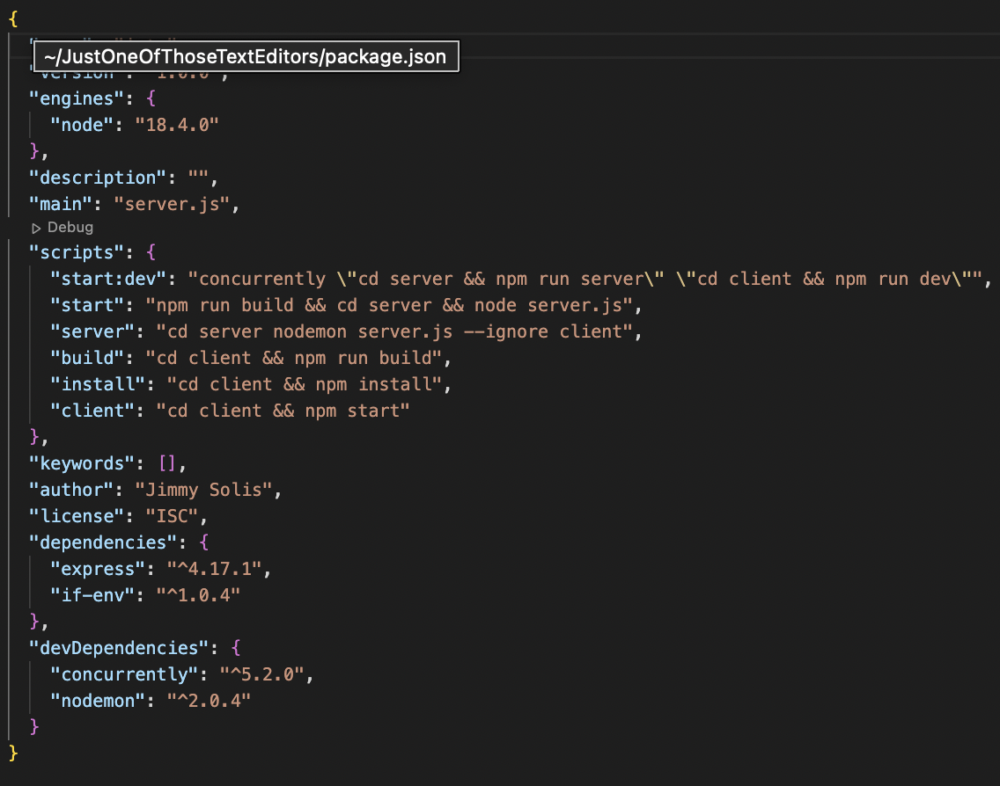

# Just One More Text Editor 
   

 ## Links:
 Repo: https://github.com/JimmySolis/JustOneOfThoseTextEditors
  
 App: https://justonemoretexteditor.herokuapp.com/

  ## Description
  In this project I had the task to create a text editor that used the indexedDb and had the capability to be downloaded using manifest. 

  ## Table of Contents 
  - [Installation](#installation)
  - [Usage](#usage)
  - [Walkthough](#walkthough)

  ## Installation
  To install the program simply use the link provided to the website. Once there there is an install botton on top that will prompt you to download.

  ## Usage
  To use the program simply write a console.log and once you return to the next line the text will be saved. Since the service is running through a port the content will stay persistent. Look at it through you home page or your downloaded app.

  ## Walkthough

  ### 1) Aside from all the files shown in this picture, the magic happens inside the client and server folders.
  

  ### 2) Before diving into the server folder, Acknowledge the packagejson. In it we have scripts that dictate how the app should be ran & installed. This also helps once deployed to a Roku because Roku knows to start the app by saying npm start.
  

  ### 3) Next, we dive into the server folder which contains two files. These files contain how we connect to a port and it is how the server gains access to our I said asset files
  

  ### 4) After that, focusing on creating the js files That enables us to Right into indexedDb, Cope with the words in the editor, plug in a header, and also prompt the user to install the program.
  

  ### 5) In order to make bundling a possibility we need to have a webpack.config.js file. Here we declare all the necessary plug-ins to make one cohesive folder that contains the multi versatile JS file called bundle.js. 
  

  ### 6) Finally, we end up with a very neat and multi use folder that is made available to the server for every request.
   

  
  ## Questions
  Here is my email for questions:  jimmysolis14@gmail.com
   
  If you would like to look me up in github, here is my username: JimmySolis
   
  Follow these instructions to contact me:  
  Please email me with any questions.

  